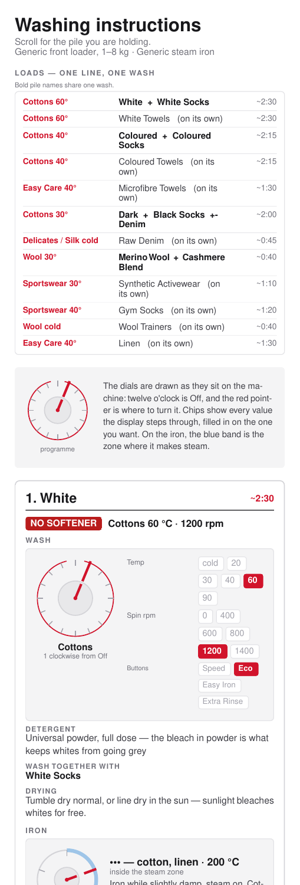
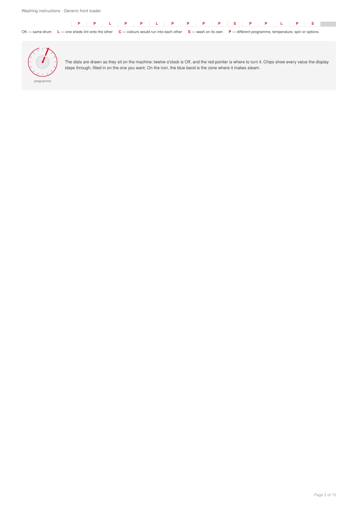
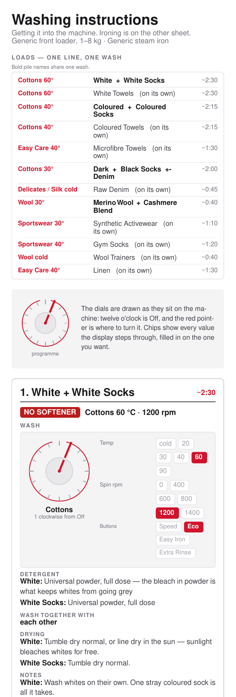
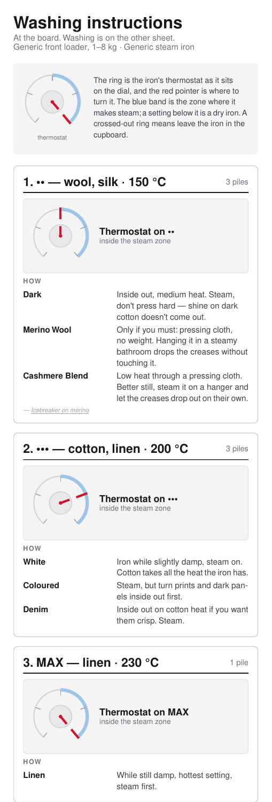
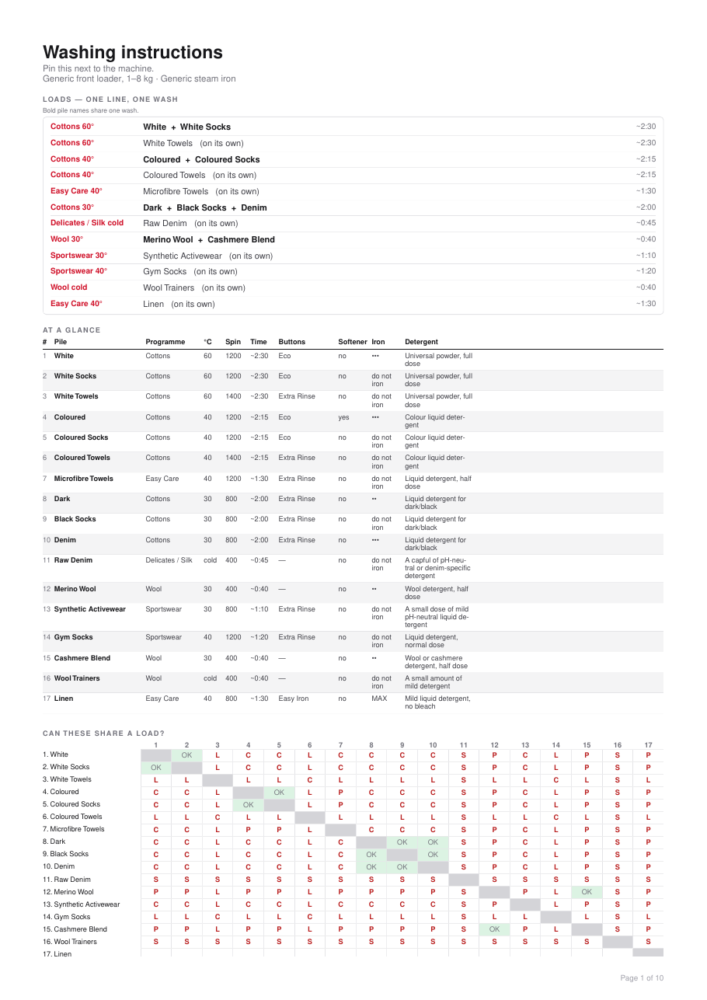
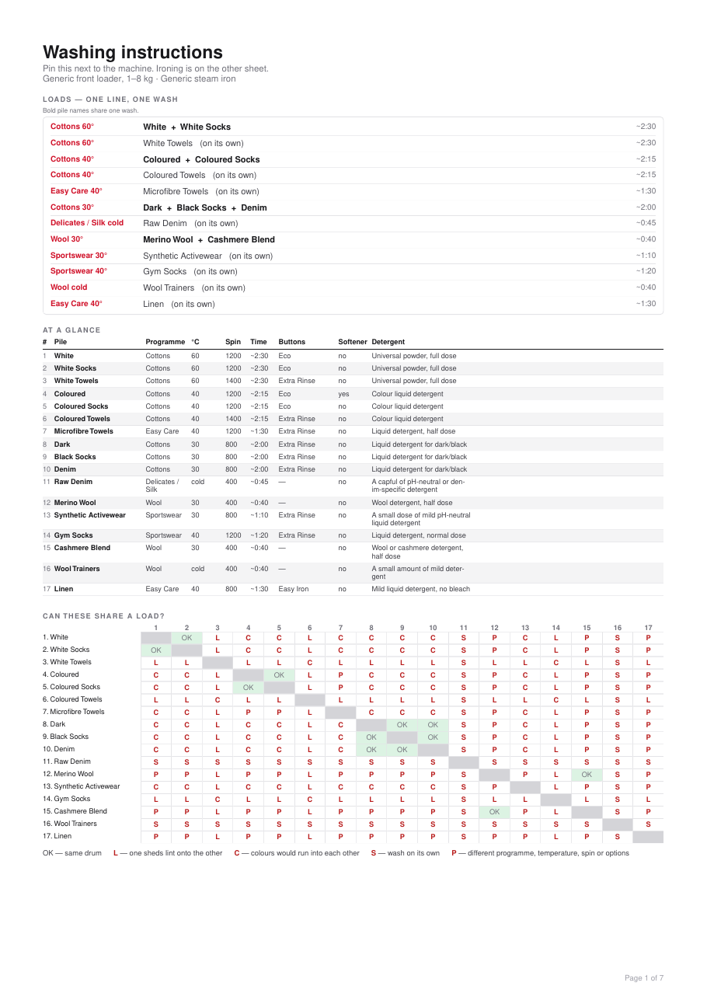
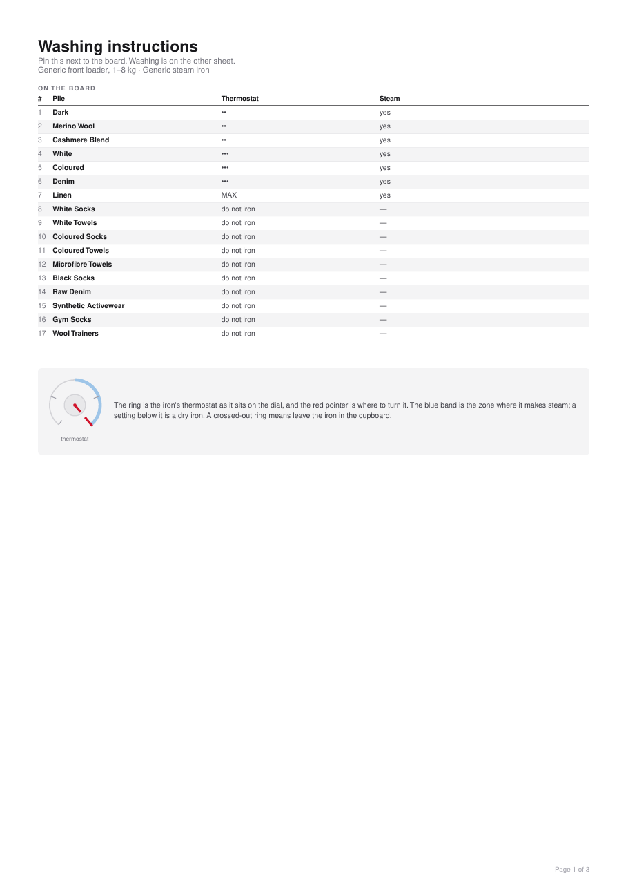

<!--
Maintainer note (not rendered): the licence badge is static because nothing is
published to a registry that could be read for it. Every other badge measures
something real — do not add one that reads "unknown".
-->

[](https://github.com/alrayyes/washy-washy-cli/actions/workflows/ci.yml)
[](https://codecov.io/gh/alrayyes/washy-washy-cli)
[](https://github.com/alrayyes/washy-washy-cli/actions/workflows/release.yml)
[](https://github.com/alrayyes/washy-washy-cli/releases/latest)
[](LICENSE)
[](https://github.com/alrayyes/washy-washy-cli/pkgs/container/washy-washy-cli)

# Washy washy

Nobody remembers whether the towels go in at 40 or 60, which button stops the
black t-shirts coming out streaky, or where on the dial "Fijn/Zijde" actually
is. This turns a CSV of laundry piles into PDFs that answer all of it, in two
shapes:

- **`out/washy-washy-phone.pdf`** — one tall, narrow page you scroll
  through on your phone while standing in front of the machine.
- **`out/washy-washy-print.pdf`** — an A4 reference sheet to pin next
  to the machine, followed by a full-page card for each pile.

Each of those also comes cut in half, because the two jobs happen in different
rooms hours apart and neither wants to read past the other to find its own:
`-washing` drops the iron, and `-ironing` drops everything about the machine.
Six files out of one run — see [the split sheets](#the-split-sheets).

Both are drawn for _your_ appliances. You describe the washing machine and the
iron once, alongside your chart, in one JSON file, and every card then shows
the programme dial with the pointer where you need to turn it, the
temperature and spin values picked out of the row the display steps through,
which option buttons to press, and the iron's thermostat ring with its steam
zone marked. You are not translating generic advice onto your machine; the
drawing _is_ your machine.

Nothing here translates a fascia label, ever. If the dial says `Fijn/Zijde`, the
card says `Fijn/Zijde` — a chart you have to translate back while standing in
front of the machine is worse than no chart. Everything the tool says _about_
the machine is in English; everything printed _on_ the machine is whatever you
typed into the machine file.

It also answers the question that actually causes arguments: what can go in
together. Piles are grouped into loads, each card names its bedfellows, and the
printed sheet carries a full compatibility matrix with the reason for every no.

| The phone sheet, from the top                                                                                                                                                   | A card from the printable set                                                                                                                                                                                                                 |
| ------------------------------------------------------------------------------------------------------------------------------------------------------------------------------- | --------------------------------------------------------------------------------------------------------------------------------------------------------------------------------------------------------------------------------------------- |
|  |  |

That is the committed example chart, not anyone's real laundry. Every sheet it
draws is here to open, so you can read the whole thing rather than a picture of
the top of it. All six come from the generic appliances and chart in
`data/washy-washy.json.dist`.

**On the phone**, top of each sheet:

<p>
  <a href="docs/washy-washy-phone.pdf"></a>
  <a href="docs/washy-washy-phone-washing.pdf"></a>
  <a href="docs/washy-washy-phone-ironing.pdf"></a>
</p>

**Printable**, the reference sheet each one opens with:

<p>
  <a href="docs/washy-washy-print.pdf"></a>
  <a href="docs/washy-washy-print-washing.pdf"></a>
  <a href="docs/washy-washy-print-ironing.pdf"></a>
</p>

Every picture is a link to the PDF it came out of. The printable ones open on
the reference sheet; the detail cards follow it.

A test redraws all six and compares them page by page against what is
committed, so the one you open is what the current chart draws, not what it
drew whenever someone last remembered to redraw them.

## Requirements

- **[Bun](https://bun.sh) 1.3 or newer** — runtime, package manager and test
  runner. Nothing else is needed; there is no build step and no browser.
- Linux, macOS or WSL. Bun's Windows support should work but is untested here.

No network access is needed at run time, and no fonts are downloaded: the PDFs
use the Helvetica that every PDF reader already has.

## Installation

```sh
bun install --frozen-lockfile
cp data/washy-washy.json.dist data/washy-washy.json     # then describe your laundry
```

The copy is not required. With no file of your own the tool reads the
committed `.dist` example, so `bun run generate` works on a fresh clone and
produces a chart for a machine that is not yours — useful for seeing the shape
of the thing, useless for actually doing laundry.

## Usage

Generate every PDF from the bundled data:

```sh
bun run generate
```

```text
Read 17 piles from /home/you/washy-washy/data/washy-washy.json.dist
  drawn for Generic front loader · Generic steam iron
  out/washy-washy-phone.pdf  one page, 6837 pt tall (11 layout passes)
  out/washy-washy-print.pdf
  out/washy-washy-phone-washing.pdf  one page, 4756 pt tall (10 layout passes)
  out/washy-washy-print-washing.pdf
  out/washy-washy-phone-ironing.pdf  one page, 1059 pt tall (9 layout passes)
  out/washy-washy-print-ironing.pdf

Piles that can share a drum:
  White + White Socks           ~2:30
  Coloured + Coloured Socks     ~2:15
  Dark + Black Socks + Denim    ~2:00
  Merino Wool + Cashmere Blend  ~0:40

Set up identically on both appliances, so sharing one card:
  Merino Wool + Cashmere Blend
```

Point it at your own file, or somewhere else for the output:

```sh
bun run generate my-laundry.json --out ~/Documents
```

The output filenames follow the input, so `my-laundry.json` gives you
`my-laundry-phone.pdf`, `my-laundry-print.pdf` and the four split sheets
beside them.

### The split sheets

Washing and ironing are the same chart read at two different moments. You stand
at the machine on a Sunday morning wanting a programme, a temperature and a
spin speed; you stand at the board on a Wednesday evening wanting a thermostat
position. Carrying the other half of the advice to either place is what makes a
card too long to read, so each run writes both halves and the whole thing.

**`-washing`** drops the iron block from every card and the iron column from the
reference sheet. It also merges harder. Dark, Black Socks and Denim each need
their own card on the full chart only because they want three different
thermostat positions — with the iron gone they are one wash and one card.

**`-ironing`** turns the chart inside out. The heading is the thermostat
position rather than the pile, because that is the order you actually work in:
set the iron once, then go through everything that goes at that heat. Piles that
are never ironed gather on a last card of their own, which is worth printing —
"is this safe to press" is the question that ruins a shirt.

Neither is a subset you could have got by folding a printout. The grouping is
different, the tables carry different columns, and the phone sheet is measured
to its own height.

### Without installing anything

You can run it with nothing on the machine but Docker. Every release publishes
an image, so there is nothing to build — mount a directory on `/out` and the
PDFs land there:

```sh
docker run --rm \
  --cap-drop=ALL --security-opt=no-new-privileges --read-only \
  --memory=256m --cpus=1 \
  -v "$PWD/out:/out" \
  ghcr.io/alrayyes/washy-washy-cli
```

Nothing in here needs a Linux capability or a writable root filesystem, so it
costs nothing to ask for none: `--cap-drop=ALL` and `--read-only` need no
matching `--cap-add` or `tmpfs` mount anywhere in this image, and the memory
and CPU limits are generous for a job this small. The rest of this section
drops those flags for readability — they carry through every example below
unchanged.

`latest` follows the newest release, and every release also answers to its full
version and to the loose ends of it — `:1.0.0`, `:1.0`, `:1` — so a compose file
can say how much drift it is willing to take. Images are built for `amd64` and
`arm64`, and each one carries a signed provenance attestation tying it to the
workflow run and commit that produced it:

```sh
gh attestation verify oci://ghcr.io/alrayyes/washy-washy-cli:latest \
  --repo alrayyes/washy-washy-cli
```

Building it yourself works the same way:

```sh
docker build -t washy-washy .
docker run --rm -v "$PWD/out:/out" washy-washy
```

That uses the dummy config baked into the image. To chart your own laundry
and appliances, mount your own config over the top — everything after the
image name goes straight to the CLI:

```sh
docker run --rm \
  -v "$PWD/out:/out" \
  -v "$PWD/data/washy-washy.json:/app/data/washy-washy.json:ro" \
  ghcr.io/alrayyes/washy-washy-cli
```

The container runs as an unprivileged user, so the PDFs come out owned by
`1000:1000` rather than by root. If that is not your own ID, `--user "$(id
-u):$(id -g)"` fixes the ownership on the way out.

## Your config

One file, `data/washy-washy.json`, describes both your appliances (the
`machine` key) and your chart (the `chart` key) — one row per pile, and
adding a pile never needs a code change.

The one that ships with the repo is
[`data/washy-washy.json.dist`](data/washy-washy.json.dist), and it is made
up — nobody's actual wardrobe or actual washing machine. Yours goes in
`data/washy-washy.json` beside it, which is gitignored, so your laundry never
lands in a commit. Copy the dist across and edit it:

```sh
cp data/washy-washy.json.dist data/washy-washy.json
```

There is no need to hurry: with no file of your own, `bun run generate` reads
the dist and says so.

Starting from a blank slate instead of the worked example:

```sh
bun run new-config             # writes data/washy-washy.json
```

That writes a placeholder machine and one placeholder pile — enough to
load and generate immediately, so you can see the shape before you fill in
your own — rather than the sixteen-pile dummy chart. It refuses to
overwrite a file that is already there.

Every config also opens with a `$schema` line pointing at
[`@washy-washy/core`'s published JSON Schema](https://cdn.jsdelivr.net/npm/@washy-washy/core/schema/config.schema.json),
so an editor that reads `$schema` (VS Code among them) autocompletes field
names and flags an obviously wrong shape as you type, before you even run
the tool. Check your work at any point, or as a CI-style check on its own:

```sh
bun run validate-config         # your file, falling back to the .dist
```

It reports the same specific field/row error `bun run generate` would if
something is wrong.

### The chart

Each entry under `chart` is one pile:

| Field             | What goes in it                                                                                         |
| ----------------- | ------------------------------------------------------------------------------------------------------- |
| `clothing_type`   | What you call the pile — this is the card heading                                                       |
| `detergent`       | Which detergent and how much                                                                            |
| `fabric_softener` | `yes` or `no`                                                                                           |
| `temperature`     | A temperature your machine offers                                                                       |
| `spin`            | A spin speed your machine offers                                                                        |
| `duration`        | Roughly how long it runs — on the loads table, the summary and the card                                 |
| `program`         | A dial position, spelled exactly as on the fascia                                                       |
| `options`         | Option buttons, pipe-separated; empty for none                                                          |
| `ironing`         | `yes` or `no` — whether you iron it at all                                                              |
| `ironing_notes`   | Prose: how to iron it, or why you don't. Often empty                                                    |
| `iron_setting`    | A thermostat position. Empty when `ironing` is `no`                                                     |
| `drying`          | Prose: how to dry it                                                                                    |
| `colour_group`    | `white`, `colour`, `dark`, `sport` or `any`                                                             |
| `mix_tags`        | Pipe-separated: `lint-shedder`, `lint-magnet`, `dye-bleeder`, `solo`                                    |
| `notes`           | Anything else worth knowing                                                                             |
| `reference_name`  | Who to credit for advice that isn't obvious from the garment itself. Empty when there's nothing to cite |
| `reference_link`  | A link backing up `reference_name`. Empty when there's nothing to cite                                  |

Every machine-facing value is checked against what the appliances in the same
file can actually be set to, so a typo fails the run rather than producing a
PDF that tells you to turn the dial somewhere it does not go:

```text
row 8, column "program": "Cottons" is not one of Uit, Katoen, Katoen + Voorwas, ...
```

### Migrating from the old two-file setup

Earlier versions kept the appliances in `data/machine.json` and the chart in
`data/washing-instructions.csv`. If you still have those,
`bun run migrate-config` reads them (falling back to their own `.dist`
examples the same way) and writes the combined
`data/washy-washy.json`:

```sh
bun run migrate-config [machine.json] [chart.csv] [out.json]
```

All three arguments default to the old paths and the new one, so
`bun run migrate-config` alone does the right thing for a setup that has not
moved yet.

### Let a chatbot write the first draft

Filling in fifteen rows of care advice from scratch is the tedious part, and it
is the part a language model is genuinely good at. Paste it your config file
as the format, so it can see both the `chart` array's shape and the exact
appliance values it is allowed to write, and a description of what you
actually own — a flat share with two sets of bed linen and a lot of running
kit is a different chart from a household with school uniforms.

Give it the file whole rather than retyping the lists out of it. Every value
it is allowed to write is in there, and it is the same file the validator will
judge the answer against.

Something like this works:

```text
Here is my washy-washy.json, describing my appliances under "machine" and
an example pile under "chart". Write me a "chart" array, one entry per pile,
for the laundry I describe.

Every machine-facing value has to come out of the "machine" key: program from
washer.programs, temperature from washer.temperatures, spin from washer.spins,
options from washer.options, and iron_setting from an iron.settings key. Spell
them exactly as they appear there.

ironing is yes or no. When it is no, leave iron_setting empty.

duration is roughly how long that programme runs on my machine, as ~H:MM.

My laundry: <describe it — fabrics, colours, what you own a lot of, what you
line dry, anything with a care label you actually follow>.
```

Two things to do with the answer. Run it: paste the array over the `chart`
key and run the tool — the validator checks every machine-facing value
against the `machine` key in the same file, so an invented programme name
fails the run rather than reaching a PDF. Then read it: a model will state a
wash temperature with total confidence and be wrong, so check anything that
would ruin a garment — wool, silk, anything with elastane — against the care
label or the maker's own guidance before you trust the chart taped to your
machine. The durations are guesses too, and yours are on the display.

### How "can these wash together" is decided

Two piles may share a drum only when all of these hold. The first one that
fails is the reason shown in the matrix.

1. Neither is tagged `solo`. Raw denim and trainers go in alone, full stop.
2. If either is a `lint-shedder`, the other must be too — terry sheds over
   everything, so towels only ever go with towels.
3. Their `colour_group` matches (`any` matches everything).
4. Programme, temperature, spin _and_ the set of option buttons are identical.

Rule 4 is why White and White Socks share a load, but White Towels do not: the
towels want 1400 rpm and an extra rinse, which is a different wash even though
the temperature agrees.

### One card for several piles

Sharing a load still gets you a card each. Dark, Black Socks and Denim wash
identically but want a two-dot iron, no iron and a three-dot iron respectively,
so the iron drawing alone justifies three cards.

Piles merge onto one card when everything you physically _set_ agrees:
programme, temperature, spin, option buttons, whether softener goes in, and
where the iron's thermostat points. Every dial drawing would be the same
drawing, so one card carries all the names — Merino Wool and Cashmere Blend, for
instance.

Prose is deliberately not part of that key. Those two want different detergent
and different drying, and the card lists both lines against the pile they belong
to rather than letting one stand in for the other.

The washing-only sheet drops the thermostat from that key and the ironing-only
sheet keeps nothing else, which is why the same chart draws a different number
of cards on each. See [the split sheets](#the-split-sheets).

## Your appliances

The machine is data, not code, and it is the `machine` key of the same
`data/washy-washy.json` your chart lives in — see [Your config](#your-config)
for how to get a copy started. The committed example describes a generic
front loader and a generic steam iron.

Inside are the dial labels in physical order, the temperatures and spin speeds
the display offers, the option buttons, and the iron's thermostat positions.
Copy each label exactly as it is printed in front of you, in whatever language
that is — the whole point is that the drawing matches the machine.

Two things follow from the order of `programs`. The first entry is the off
position and is drawn at twelve o'clock, and every other tick takes its angle
from where it sits in the list, so a programme left out does not merely go
missing: it moves all the others. `temperatures` are printed as they stand,
except that a plain number gets a degree sign, which is why a machine whose
display says `cold` or `koud` needs no special case anywhere in the code.

The chart validator takes its allowed values from whichever machine is
embedded in the config you load, so a chart written for one machine is
refused by another rather than silently drawn wrong:

```text
row 2, column "program": "Cottons" is not one of Uit, Katoen, Katoen + Voorwas, ...
```

### Let a chatbot read your machine off a photo

Typing out sixteen dial labels in a language you may not read is the tedious
part, and you do not have to. Take a photo of the fascia and a photo of the
iron's thermostat ring, paste them to a chatbot along with the `machine` key
of the `.dist` file as the format, and ask for the same shape for your
appliances.

A photo beats describing it here, and for a reason specific to this tool. The
order of `programs` is load-bearing — every tick's angle comes from where it
sits in the list — and a photo has that order in it. Describe the same dial in
words, and you will almost certainly list the programmes in an order that makes
sense rather than the order they go round.

Something like this works:

```text
Attached is a photo of my washing machine's fascia and one of my iron's
thermostat, plus an example file. Write me the same shape for these
appliances.

Copy every label exactly as printed, in whatever language it is in. Do not
translate any of them into English, and do not tidy up the spelling or the
punctuation.

washer.programs is the dial, listed in the order the positions go round it,
starting at the off position. Read that order off the dial rather than
grouping the programmes sensibly.
```

Then check it against the machine before you run it, because two things go
wrong. Small or angled text gets misread, so the labels are worth reading back
one by one. And nothing in a photo says which position is off — the model has
to guess, and if it guesses wrong every dial in every PDF is rotated. Start at
the off position and go clockwise yourself.

After that, run it. `parseMachine` refuses a file that is missing a field or
repeats a programme, and the chart validator then refuses a chart written for
your old machine, naming the first row that no longer fits. That second one is
the useful failure when you replace an appliance: the chart does not silently
draw the wrong dial, it stops and tells you which rows need new programme
names.

## The web app

Live at [washy-washy.ryankes.eu](https://washy-washy.ryankes.eu), source at
[alrayyes/washy-washy-web](https://github.com/alrayyes/washy-washy-web) — a
separate repo since the four-way split of what used to be this monorepo. It
shares `@washy-washy/core`'s chart parsing, mixing rules and machine
validation with this CLI as a published dependency, so a rule change in
core lands in both once each picks up the new version.

## Contributing

Everything about working on this — the commands, the linters, the tests, the git
hooks and how a release is cut — is in [CONTRIBUTING.md](CONTRIBUTING.md). Short
version: `bun run check` before you push, commit under
[Conventional Commits](https://www.conventionalcommits.org/), and say in the
commit body where a changed wash setting came from. Care advice is sourced, not
guessed.

## Where the current advice comes from

The bundled data was assembled from manufacturer and trade guidance:
[Which? on wash temperatures](https://www.which.co.uk/reviews/washing-machines/article/washing-machine-temperature-guide-aLiyf2p96y4d),
[Icebreaker on merino](https://eu.icebreaker.com/en-gb/blogs/journal/how-to-wash-merino-wool-jumper),
[Hiut Denim](https://hiutdenim.co.uk/pages/washing-instructions) and
[Blue Owl Workshop](https://www.blueowl.us/blogs/news/how-to-wash-your-raw-denim-selvedge-jeans)
on raw selvedge,
[Peacock Alley on towels](https://www.peacockalley.com/pages/towel-care-guide),
[Tefal's Easygliss Plus manual](https://www.tefal.com/instructions-for-use/csp/1830007452)
for the thermostat markings, and
[Dirty Labs](https://dirtylabs.com/blogs/the-dirt/how-to-wash-your-activewear)
on synthetic activewear.

## Licence

[GNU General Public License v3.0 or later](LICENSE). Use it, change it, pass it
on — but anything you distribute that is built on it comes with the same freedom
attached, source included.

The care advice in `data/washy-washy.json.dist` is assembled from the
manufacturer and trade sources listed above, and is offered in the same spirit
as the code: no warranty. Your care labels outrank it.
